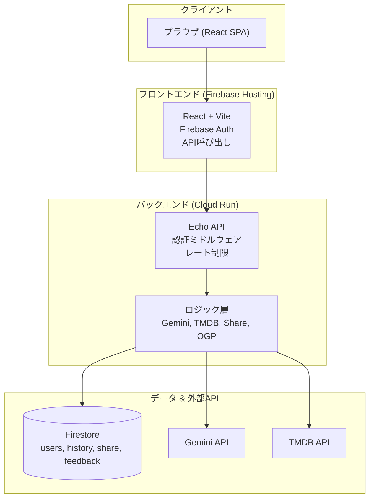
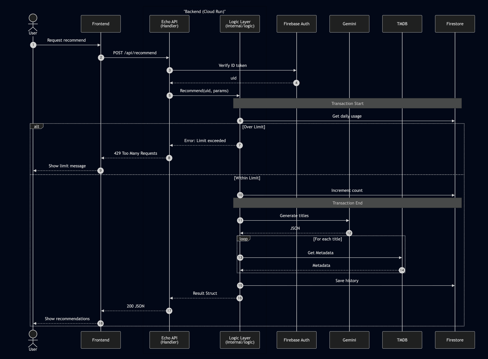

# TYPECAST


**MBTIベースの映画レコメンドサービス**

🌐 **[English version here](./README.md)**

**第4回 Agentic AI Hackathon with Google Cloud** 提出作品

https://zenn.dev/hackathons/google-cloud-japan-ai-hackathon-vol4

<p align="center">
  
  
  
  
  
</p>

---

## 📖 目次

- [概要](#概要)
- [主な機能](#主な機能)
- [アーキテクチャ](#アーキテクチャ)
- [技術スタック](#技術スタック)
- [開発環境のセットアップ](#開発環境のセットアップ)
- [デプロイ](#デプロイ)
- [セキュリティ](#セキュリティ)
- [ライセンス](#ライセンス)

---

## 概要

TYPECASTは、**MBTIの心理機能**（Ti、Ne、Ni、Teなど）に基づいて映画を推薦するサービスです。単なる「気分」ではなく、AIが「なぜその映画があなたのタイプに合うのか」を論理的に説明します。

### ターゲットユーザー

- **自分のMBTIタイプを知っている人**で、感情的なラベルよりも論理を好む方（例：INTP、INTJ、ENTPなどの分析型）
- **「泣ける」「元気が出る」といった曖昧なタグよりも**、脚本の一貫性、概念的な深さ、思考実験的な魅力を重視する方
- **何を観るか迷ってしまう方**で、明確な理由に基づいた映画の提案が欲しい方

### 解決する課題

1. **感情のみのレコメンドはミスマッチが多い**  
   「泣ける」「元気が出る」といった従来の指標は、論理志向のユーザーには響きにくい。

2. **MBTIと映画の関連性が明確でない**  
   タイプ診断は存在するが、心理機能の観点から「なぜその映画が合うのか」を説明するサービスは少ない。

3. **気分と履歴が活用されていない**  
   現在の気分や視聴履歴が考慮されないと、レコメンドが重複したり的外れになる。

### ソリューションの特徴

- **心理機能ベースのレコメンド**  
  16タイプそれぞれに対して、主機能・補助機能（Ti、Ne、Ni、Teなど）を使い、AIが映画を提案し、理由を説明します。

- **気分 × 感情スコア**  
  自由記述の「気分」をAIが分析し、スコア化（-5〜+5）。データが蓄積すると週次チャートで可視化できます。

- **履歴管理、重複なし**  
  過去に推薦された作品はFirestoreに保存され、次回以降の推薦から自動的に除外されます。

- **視聴可能な配信サービス**  
  TMDB APIと連携し、日本で視聴可能なストリーミングサービス（Netflix、U-NEXT、Prime Videoなど）へのリンクを表示します。

---

## 主な機能

### 1. 論理ベースの映画レコメンド

- 16種類のMBTIタイプすべてに対応
- AIが心理機能（主機能・補助機能）の観点から「なぜその映画が合うのか」を説明
- 現在の気分とMBTIタイプに基づいた推薦

### 2. 感情スコア & 週次リズム

- 気分テキストを分析してスコア化（-5〜+5）
- データが蓄積すると週次チャートで可視化
- 自分の感情パターンを時系列で追跡

### 3. 履歴管理

- 推薦された映画はすべてFirestoreに保存
- 過去に推薦された作品は自動的に除外
- 完全な推薦履歴の閲覧が可能

### 4. 配信サービス連携

- TMDB APIと連携して映画のメタデータを取得
- 日本で視聴可能なストリーミングサービスへの直接リンク
- ポスター画像、公開日、評価を表示

### 5. シェア機能

- ユニークなリンクで推薦結果をシェア
- ソーシャルメディア向けの動的OGP（Open Graph Protocol）
- Twitter/X最適化されたカード表示（気分とスコア付き）

### 6. アカウント管理

- Firebase経由のGoogleログイン
- 24時間のクールダウン付きアカウント削除
- 履歴とフィードバックを含む完全なデータ削除

---

## アーキテクチャ

このプロジェクトは**モノレポ**構成で、フロントエンド（`typecast-web`）とバックエンド（Go API）が1つのリポジトリに含まれています。Cloud RunとFirebase HostingのCI/CD設定がGitHub Actionsで統一されています。

### ディレクトリ構成

```
typecast/
├── .github/              # CI/CDワークフロー（deploy-backend.yml, deploy-frontend.yml）
├── cmd/                  # Goアプリケーションのエントリーポイント
│   └── api/              # APIサーバーのmain.go
├── internal/             # Go内部パッケージ
│   ├── handler/          # HTTPハンドラー（account, feedback, history, recommend, share, ogp）
│   ├── logic/            # ビジネスロジック（gemini, tmdb, mbti, user など）
│   ├── middleware/       # 認証ミドルウェア
│   ├── model/            # データモデル（DTO, user, history）
│   └── security/         # セキュリティユーティリティ（identity）
├── typecast-web/         # フロントエンドReactアプリケーション
│   ├── src/              # Reactソースコード
│   │   ├── components/   # 再利用可能なコンポーネント
│   │   ├── pages/        # ページコンポーネント（MyPage など）
│   │   ├── services/     # APIクライアントサービス
│   │   ├── lib/          # ユーティリティ（apiClient）
│   │   └── types/        # TypeScript型定義
│   └── public/           # 静的アセット
├── docs/                 # ドキュメントと図表
│   ├── diagrams/         # Mermaid図表（PNG出力）
│   └── articles/         # 記事・解説
├── scripts/              # 開発用ユーティリティスクリプト
├── assets/               # 共有アセット（フォントなど）
├── Dockerfile            # バックエンドコンテナ定義
├── firebase.json         # Firebase Hosting設定
├── firestore.rules       # Firestoreセキュリティルール
├── go.mod / go.sum       # Go依存関係
├── README.md             # 英語版README
├── README.ja.md          # このファイル（日本語）
├── SECURITY.md           # セキュリティガイド（日本語）
├── SECURITY.en.md        # セキュリティガイド（英語）
├── CONTRIBUTING.md       # コントリビューションガイドライン（英語）
├── CONTRIBUTING.ja.md    # コントリビューションガイドライン（日本語）
└── CHANGELOG.md          # バージョン履歴とリリースノート
```

### システムアーキテクチャ




### レイヤーの役割

| レイヤー | 役割 |
|---------|------|
| **フロントエンド** | React (Vite)、Firebase Auth、履歴・推薦・シェア・フィードバックのAPI呼び出し |
| **API (Echo)** | 認証ミドルウェア、日次レート制限、ルーティング、CORS設定 |
| **ロジック** | Gemini（推薦、感情スコア）、TMDB（映画メタデータ）、Firestore操作 |
| **データ** | Firestore（users, history, share, feedback）と外部API（Gemini, TMDB） |

### データフロー

#### レコメンドフロー



1. ユーザーがMBTIタイプと現在の気分を送信
2. バックエンドがFirestoreから推薦履歴を取得
3. Gemini APIが3本の映画を推薦し、理由を説明
4. TMDB APIが映画のメタデータ（ポスター、配信リンク）を補完
5. 結果を履歴に保存し、フロントエンドに返却

#### ローカル開発セットアップフロー


---

## 技術スタック

| 領域 | 技術 |
|------|------|
| **フロントエンド** | React 19, Vite, TypeScript, Tailwind CSS 4, Recharts, Lucide React |
| **バックエンド** | Go 1.25, Echo v4 |
| **AI** | Google Gemini API (gemini-2.0-flash) |
| **映画データ** | TMDB API |
| **データベース** | Firebase Firestore |
| **認証** | Firebase Authentication (Google Sign-In) |
| **インフラ** | Google Cloud Run (API), Firebase Hosting (SPA) |
| **DevOps** | Docker, GitHub Actions (CI/CD) |

---

## 開発環境のセットアップ

### 前提条件

- Go 1.25+
- Node.js 20+
- Docker（オプション）
- Firebaseプロジェクト
- Cloud Runが有効なGCPプロジェクト

### 1. リポジトリのクローン

```bash
git clone https://github.com/your-username/typecast.git
cd typecast
```

### 2. バックエンドのセットアップ

#### 環境変数

プロジェクトルートに `.env` ファイルを作成：

```bash
# サーバー
PORT=8080

# APIキー
GEMINI_API_KEY=your_gemini_api_key_here
TMDB_API_KEY=your_tmdb_api_key_here

# Firebase / Firestore
VITE_FIREBASE_PROJECT_ID=your-firebase-project-id
FIRESTORE_DB_NAME=(default)

# Geminiプロンプト（Base64エンコード済み）
GEMINI_PROMPT_TEMPLATE_B64=your_base64_encoded_prompt

# レート制限
DAILY_RECOMMEND_LIMIT=5
ACCOUNT_RECREATE_COOLDOWN_HOURS=24

# URL（本番環境用）
FRONTEND_URL=https://tycast.net
API_BASE_URL=https://typecast-api-xxx.run.app
```

#### サービスアカウント

ローカル開発用に、プロジェクトルートに `service-account.json` を配置：

1. GCP Console → IAM & Admin → Service Accounts
2. Firestore権限を持つサービスアカウントを作成
3. JSON鍵ファイルをダウンロード
4. `service-account.json` にリネーム

#### バックエンドの起動

```bash
go run cmd/api/main.go
```

APIは `http://localhost:8080` で起動します。

### 3. フロントエンドのセットアップ

#### 環境変数

`typecast-web/` に `.env` ファイルを作成：

```bash
# API URL
VITE_API_URL=http://localhost:8080

# Firebase設定
VITE_FIREBASE_API_KEY=your_firebase_web_api_key
VITE_FIREBASE_AUTH_DOMAIN=your-project.firebaseapp.com
VITE_FIREBASE_PROJECT_ID=your-firebase-project-id
VITE_FIREBASE_STORAGE_BUCKET=your-project.firebasestorage.app
VITE_FIREBASE_MESSAGING_SENDER_ID=your_sender_id
VITE_FIREBASE_APP_ID=your_app_id
```

#### 依存関係のインストールと起動

```bash
cd typecast-web
npm install
npm run dev
```

アプリは `http://localhost:5173` で起動します。

### 4. Firebase設定

#### 認証の有効化

1. Firebase Console → Authentication
2. Googleサインインプロバイダを有効化
3. 承認済みドメインに `localhost` を追加

#### Firestoreルールのデプロイ

```bash
firebase deploy --only firestore:rules
```

### 5. localhostでGoogleログインできない場合

- **開発時は `signInWithPopup`**（ポップアップ）、**本番は `signInWithRedirect`**（リダイレクト）を使用しています
- Firebase Console で **認証 → 設定 → 承認済みドメイン** に `localhost` が含まれているか確認してください

---

## デプロイ

### バックエンド（Cloud Run）

#### 前提条件

1. `asia-northeast2`（大阪）にArtifact Registryリポジトリを作成：
   ```bash
   gcloud artifacts repositories create typecast-repo \
     --repository-format=docker \
     --location=asia-northeast2
   ```

2. GitHub Secretsを設定：
   - `GCP_PROJECT_ID`
   - `GCP_SA_KEY`（サービスアカウントJSON）
   - `GEMINI_API_KEY`
   - `TMDB_API_KEY`
   - `GEMINI_PROMPT_TEMPLATE_B64`
   - `VITE_FIREBASE_PROJECT_ID`
   - `FIRESTORE_DB_NAME`
   - `PROD_FRONTEND_URL`
   - `PROD_API_BASE_URL`
   - `DAILY_RECOMMEND_LIMIT`

#### 自動デプロイ

`main` ブランチへのプッシュでGitHub Actionsが起動：
- Dockerイメージをビルド
- Artifact Registry（大阪）にプッシュ
- Cloud Run（東京）にデプロイ

### フロントエンド（Firebase Hosting）

#### 前提条件

GitHub Secretsを設定：
- `VITE_API_URL`（Cloud Run URL）
- `VITE_FIREBASE_API_KEY`
- `VITE_FIREBASE_AUTH_DOMAIN`
- `VITE_FIREBASE_PROJECT_ID`
- `VITE_FIREBASE_STORAGE_BUCKET`
- `VITE_FIREBASE_MESSAGING_SENDER_ID`
- `VITE_FIREBASE_APP_ID`

#### 自動デプロイ

`main` ブランチへのプッシュでGitHub Actionsが起動：
- 本番環境変数でReactアプリをビルド
- Firebase Hostingにデプロイ

---

## セキュリティ

### Firestoreセキュリティルール

`firestore.rules` で以下のアクセス制御を実装：
- ユーザーは自分のデータのみ読み書き可能
- シェアリンクは誰でも読み取り可能（OGP用）
- 削除済みIDはサーバーサイドのみアクセス可能

### Firebase APIキー制限（推奨）

GCP ConsoleでAPIキー制限を設定：

1. **GCP Console > APIs & Services > Credentials** にアクセス
2. Firebase Web APIキーを選択
3. **アプリケーションの制限** を追加：
   - HTTPリファラー: `https://tycast.net/*`, `https://*.tycast.net/*`
4. **API制限** を追加：
   - Identity Toolkit API
   - Token Service API
   - Cloud Firestore API

詳細なセキュリティ設定については、[SECURITY.md](./SECURITY.md) を参照してください。

---

## コントリビューション

コントリビューションを歓迎します！Pull Requestを送る前に、[コントリビューションガイドライン](./CONTRIBUTING.ja.md)をお読みください。

セキュリティ関連の問題については、[セキュリティポリシー](./SECURITY.md)を参照してください。

---

## 変更履歴

変更の詳細な履歴については、[CHANGELOG.md](./CHANGELOG.md)を参照してください。

---

## ライセンス

MIT License

---

## お問い合わせ

質問や問題がある場合は、GitHubでIssueを開いてください。
