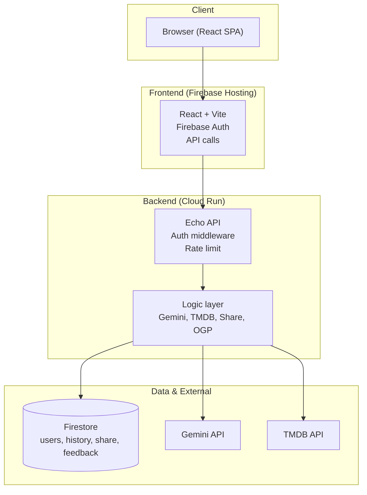

# TYPECAST


**MBTI-based movie recommendation service**

🌐 **[日本語版はこちら (Japanese)](./README.ja.md)**

Submitted to **the 4th Agentic AI Hackathon with Google Cloud**.

https://zenn.dev/hackathons/google-cloud-japan-ai-hackathon-vol4

<p align="center">
  
  
  
  
  
</p>

---

## 📖 Table of Contents

- [Overview](#overview)
- [Key Features](#key-features)
- [Architecture](#architecture)
- [Tech Stack](#tech-stack)
- [Getting Started](#getting-started)
- [Deployment](#deployment)
- [Security](#security)
- [License](#license)

---

## Overview

TYPECAST recommends movies based on **MBTI psychological functions** (Ti, Ne, Ni, Te, etc.)—not just "mood." The AI explains *why* each film fits your type, providing logic-based suggestions instead of vague emotional tags.

### Target Users

- **People who know their MBTI type** and prefer logic over purely emotional labels (e.g., analytical types such as INTP, INTJ, ENTP)
- **Users who care more about** script consistency, conceptual depth, and thought-experiment appeal than "sad" or "feel-good" tags
- **Anyone who gets stuck choosing what to watch** and wants movie suggestions with clear, reason-based explanations

### Problems We Address

1. **Emotion-only recommendations often miss**  
   Traditional cues like "makes you cry" or "feel-good" tend to resonate less with logic-oriented users.

2. **MBTI and movies are rarely connected in a clear way**  
   While type quizzes exist, few services explain *why* a film fits a type from a psychological-function perspective.

3. **Mood and history are underused**  
   When current mood and viewing history are not factored in, recommendations repeat or feel off-target.

### Solution Highlights

- **Psychology-function-based recommendations**  
  For each of the 16 types, the AI uses main/auxiliary functions (Ti, Ne, Ni, Te, etc.) and suggests films with explanations.

- **Mood × emotion score**  
  Free-text "mood" is analyzed by the AI and converted into a score (-5 to +5). This supports weekly trend visualization.

- **History-aware, no repeats**  
  Previously recommended titles are stored and automatically excluded from future recommendations.

- **Where to watch**  
  TMDB integration shows direct links to streaming services (Netflix, U-NEXT, Prime Video, etc.) available in Japan.

---

## Key Features

### 1. Logic-Based Movie Recommendations

- Supports all 16 MBTI types
- AI explains *why* each film fits from a psychological-function perspective (main/auxiliary functions)
- Recommendations based on current mood and MBTI type

### 2. Emotion Score & Weekly Rhythm

- Mood text is analyzed and scored (-5 to +5)
- Weekly chart visualization available after accumulating data
- Track your emotional patterns over time

### 3. History Management

- All recommended movies are stored in Firestore
- Automatic exclusion of previously recommended titles
- View your complete recommendation history

### 4. Streaming Provider Integration

- TMDB API integration for movie metadata
- Direct links to streaming services available in Japan
- Poster images, release dates, and ratings

### 5. Share Functionality

- Share your recommendations via unique links
- Dynamic OGP (Open Graph Protocol) for social media
- Twitter/X-optimized card display with mood and score

### 6. Account Management

- Google Authentication via Firebase
- Account deletion with 24-hour cooldown
- Complete data removal including history and feedback

---

## Architecture

This is a **monorepo** containing both frontend (`typecast-web`) and backend (Go API). This structure keeps Cloud Run and Firebase Hosting configuration unified in GitHub Actions.

### Directory Structure

```
typecast/
├── .github/              # CI/CD workflows (deploy-backend.yml, deploy-frontend.yml)
├── cmd/                  # Go application entry points
│   └── api/              # API server main.go
├── internal/             # Go internal packages
│   ├── handler/          # HTTP handlers (account, feedback, history, recommend, share, ogp)
│   ├── logic/            # Business logic (gemini, tmdb, mbti, user, etc.)
│   ├── middleware/       # Auth middleware
│   ├── model/            # Data models (DTOs, user, history)
│   └── security/         # Security utilities (identity)
├── typecast-web/         # Frontend React application
│   ├── src/              # React source code
│   │   ├── components/   # Reusable components
│   │   ├── pages/        # Page components (MyPage, etc.)
│   │   ├── services/     # API client services
│   │   ├── lib/          # Utilities (apiClient)
│   │   └── types/        # TypeScript type definitions
│   └── public/           # Static assets
├── docs/                 # Documentation and diagrams
│   ├── diagrams/         # Mermaid diagrams (PNG exports)
│   └── articles/         # Articles and writeups
├── scripts/              # Development utility scripts
├── assets/               # Shared assets (fonts, etc.)
├── Dockerfile            # Backend container definition
├── firebase.json         # Firebase Hosting configuration
├── firestore.rules       # Firestore security rules
├── go.mod / go.sum       # Go dependencies
├── README.md             # This file (English)
├── README.ja.md          # Japanese README
├── SECURITY.md           # Security guide (Japanese)
├── SECURITY.en.md        # Security guide (English)
├── CONTRIBUTING.md       # Contributing guidelines (English)
├── CONTRIBUTING.ja.md    # Contributing guidelines (Japanese)
├── CHANGELOG.md          # Version history and release notes
└── LICENSE               # MIT License
```

### System Architecture




### Layer Roles

| Layer | Role |
|-------|------|
| **Frontend** | React (Vite), Firebase Auth, API calls for history, recommend, share, and feedback |
| **API (Echo)** | Auth middleware, daily rate limit, routing, CORS configuration |
| **Logic** | Gemini (recommendations, emotion score), TMDB (movie metadata), Firestore operations |
| **Data** | Firestore (users, history, share, feedback) and external APIs (Gemini, TMDB) |

### Data Flow

#### Recommendation Flow


1. User submits MBTI type and current mood
2. Backend fetches recommendation history from Firestore
3. Gemini API generates 3 movie recommendations with explanations
4. TMDB API enriches movie metadata (poster, streaming links)
5. Results are saved to history and returned to frontend

#### Local Development Setup Flow


---

## Tech Stack

| Area | Technology |
|------|------------|
| **Frontend** | React 19, Vite, TypeScript, Tailwind CSS 4, Recharts, Lucide React |
| **Backend** | Go 1.25, Echo v4 |
| **AI** | Google Gemini API (gemini-2.0-flash) |
| **Movie Data** | TMDB API |
| **Database** | Firebase Firestore |
| **Authentication** | Firebase Authentication (Google Sign-In) |
| **Infrastructure** | Google Cloud Run (API), Firebase Hosting (SPA) |
| **DevOps** | Docker, GitHub Actions (CI/CD) |

---

## Getting Started

### Prerequisites

- Go 1.25+
- Node.js 20+
- Docker (optional)
- Firebase project
- GCP project with Cloud Run enabled

### 1. Clone the Repository

```bash
git clone https://github.com/your-username/typecast.git
cd typecast
```

### 2. Backend Setup

#### Environment Variables

Create a `.env` file in the project root:

```bash
# Server
PORT=8080

# API Keys
GEMINI_API_KEY=your_gemini_api_key_here
TMDB_API_KEY=your_tmdb_api_key_here

# Firebase / Firestore
VITE_FIREBASE_PROJECT_ID=your-firebase-project-id
FIRESTORE_DB_NAME=(default)

# Gemini Prompt (Base64 encoded)
GEMINI_PROMPT_TEMPLATE_B64=your_base64_encoded_prompt

# Rate Limiting
DAILY_RECOMMEND_LIMIT=5
ACCOUNT_RECREATE_COOLDOWN_HOURS=24

# URLs (for production)
FRONTEND_URL=https://tycast.net
API_BASE_URL=https://typecast-api-xxx.run.app
```

#### Service Account

For local development, place `service-account.json` in the project root:

1. Go to GCP Console → IAM & Admin → Service Accounts
2. Create a service account with Firestore permissions
3. Download the JSON key file
4. Rename it to `service-account.json`

#### Run the Backend

```bash
go run cmd/api/main.go
```

The API will start on `http://localhost:8080`.

### 3. Frontend Setup

#### Environment Variables

Create a `.env` file in `typecast-web/`:

```bash
# API URL
VITE_API_URL=http://localhost:8080

# Firebase Configuration
VITE_FIREBASE_API_KEY=your_firebase_web_api_key
VITE_FIREBASE_AUTH_DOMAIN=your-project.firebaseapp.com
VITE_FIREBASE_PROJECT_ID=your-firebase-project-id
VITE_FIREBASE_STORAGE_BUCKET=your-project.firebasestorage.app
VITE_FIREBASE_MESSAGING_SENDER_ID=your_sender_id
VITE_FIREBASE_APP_ID=your_app_id
```

#### Install Dependencies and Run

```bash
cd typecast-web
npm install
npm run dev
```

The app will start on `http://localhost:5173`.

### 4. Firebase Configuration

#### Enable Authentication

1. Go to Firebase Console → Authentication
2. Enable Google Sign-In provider
3. Add `localhost` to authorized domains

#### Deploy Firestore Rules

```bash
firebase deploy --only firestore:rules
```

---

## Deployment

### Backend (Cloud Run)

#### Prerequisites

1. Create Artifact Registry repository in `asia-northeast2` (Osaka):
   ```bash
   gcloud artifacts repositories create typecast-repo \
     --repository-format=docker \
     --location=asia-northeast2
   ```

2. Set up GitHub Secrets:
   - `GCP_PROJECT_ID`
   - `GCP_SA_KEY` (Service Account JSON)
   - `GEMINI_API_KEY`
   - `TMDB_API_KEY`
   - `GEMINI_PROMPT_TEMPLATE_B64`
   - `VITE_FIREBASE_PROJECT_ID`
   - `FIRESTORE_DB_NAME`
   - `PROD_FRONTEND_URL`
   - `PROD_API_BASE_URL`
   - `DAILY_RECOMMEND_LIMIT`

#### Automatic Deployment

Push to `main` branch triggers GitHub Actions:
- Builds Docker image
- Pushes to Artifact Registry (Osaka)
- Deploys to Cloud Run (Tokyo)

### Frontend (Firebase Hosting)

#### Prerequisites

Set up GitHub Secrets:
- `VITE_API_URL` (Cloud Run URL)
- `VITE_FIREBASE_API_KEY`
- `VITE_FIREBASE_AUTH_DOMAIN`
- `VITE_FIREBASE_PROJECT_ID`
- `VITE_FIREBASE_STORAGE_BUCKET`
- `VITE_FIREBASE_MESSAGING_SENDER_ID`
- `VITE_FIREBASE_APP_ID`

#### Automatic Deployment

Push to `main` branch triggers GitHub Actions:
- Builds React app with production environment variables
- Deploys to Firebase Hosting

---

## Security

### Firestore Security Rules

The project includes `firestore.rules` that enforce:
- Users can only read/write their own data
- Share links are publicly readable (for OGP)
- Deleted identities are server-side only

### Firebase API Key Restrictions (Recommended)

Configure API key restrictions in GCP Console:

1. Go to **GCP Console > APIs & Services > Credentials**
2. Find your Firebase Web API Key
3. Add **Application restrictions**:
   - HTTP referrers: `https://tycast.net/*`, `https://*.tycast.net/*`
4. Add **API restrictions**:
   - Identity Toolkit API
   - Token Service API
   - Cloud Firestore API

For detailed security configuration, see [SECURITY.md](./SECURITY.md).

---

## Contributing

Contributions are welcome! Please read our [Contributing Guidelines](./CONTRIBUTING.md) before submitting a Pull Request.

For security-related issues, please refer to our [Security Policy](./SECURITY.en.md).

---

## Changelog

See [CHANGELOG.md](./CHANGELOG.md) for a detailed history of changes.

---

## License

This project is licensed under the MIT License - see the [LICENSE](./LICENSE) file for details.

---

## Contact

For questions or issues, please open an issue on GitHub.
