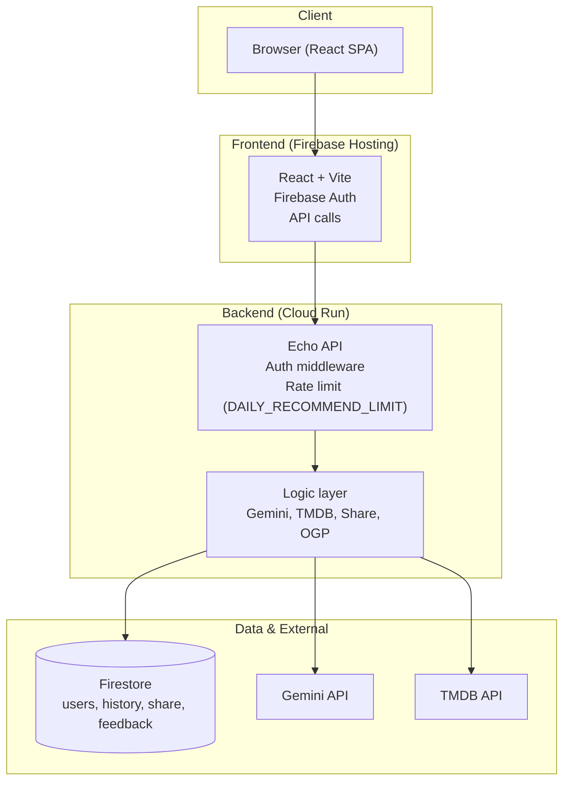
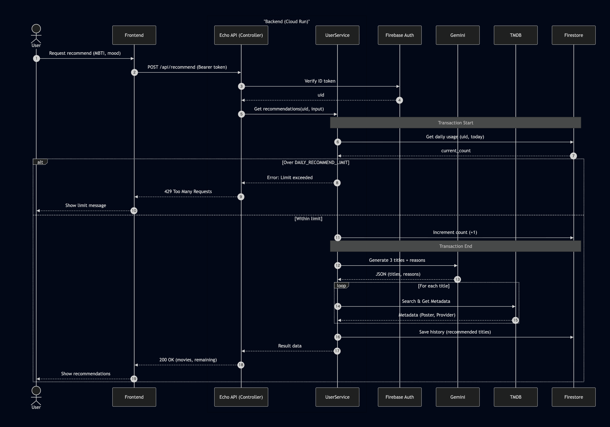
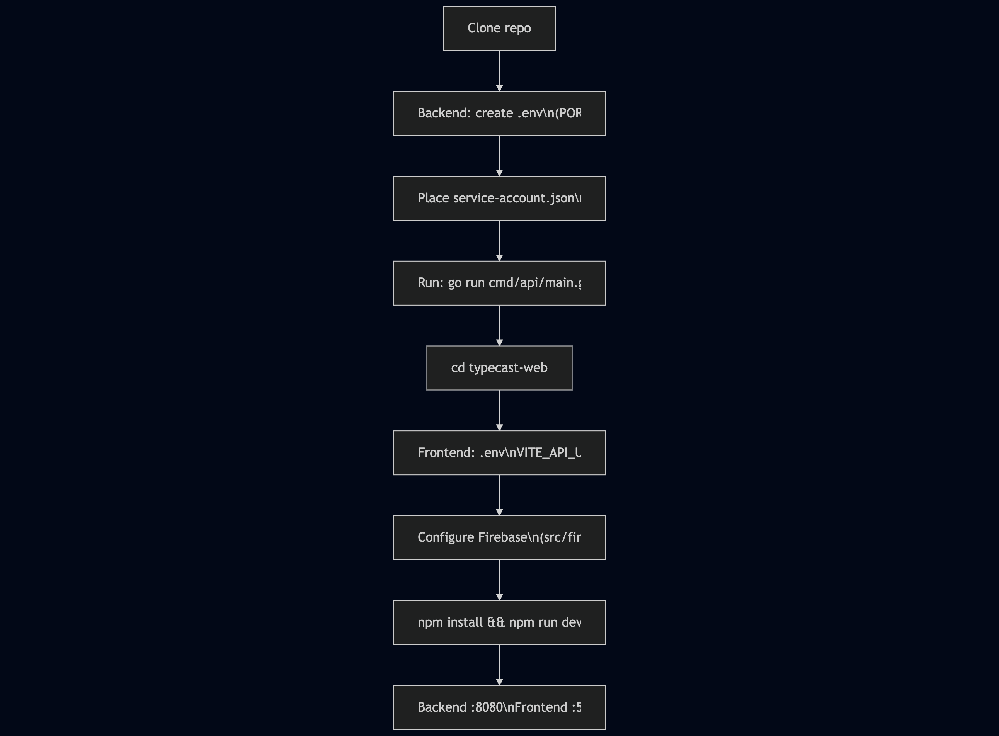

# TYPECAST


**MBTI-based movie recommendation service**

Submitted to **the 4th Agentic AI Hackathon with Google Cloud**.

https://zenn.dev/hackathons/google-cloud-japan-ai-hackathon-vol4

TYPECAST recommends movies based on MBTI psychological functions (Ti, Ne, Ni, Te, etc.)—not just "mood." The AI explains *why* each film fits your type so you get logic-based suggestions instead of vague emotional tags.

<p align="center">
  
  
  
  
  
</p>

---

## Project overview

### Target users

- **People who know their MBTI type** and prefer logic over purely emotional labels (e.g. analytical types such as INTP, INTJ, ENTP).
- **Users who care more about** script consistency, conceptual depth, and thought-experiment appeal than about "sad" or "feel-good" tags.
- **Anyone who gets stuck choosing what to watch** and wants movie suggestions with clear, reason-based explanations that match their current mood and type.

### Problems we address

- **Emotion-only recommendations often miss.**  
  Traditional cues like "makes you cry" or "feel-good" tend to resonate less with logic-oriented users.
- **MBTI and movies are rarely connected in a clear way.**  
  While type quizzes exist, few services explain *why* a film fits a type from a psychological-function perspective.
- **Mood and history are underused.**  
  When current mood and viewing history are not factored in, recommendations repeat or feel off-target.

### Solution highlights

- **Psychology-function-based recommendations**  
  For each of the 16 types, the AI uses main/auxiliary functions (Ti, Ne, Ni, Te, etc.) and suggests films with short explanations of why they match.
- **Mood × emotion score**  
  Free-text "mood" is analyzed by the AI and turned into a score (e.g. -5 to +5). This supports weekly trend views as data accumulates.
- **History-aware, no repeats**  
  Previously recommended titles are stored and automatically excluded from future recommendations so users keep discovering new options.
- **Where to watch**  
  TMDB integration shows direct links to streaming services (Netflix, U-NEXT, Prime Video, etc.) available in Japan.

---

## Architecture

The repository is a **monorepo**: frontend (`typecast-web`) and backend (Go API) live in one place. This keeps Cloud Run and Firebase Hosting configuration in GitHub Actions and makes it easy for anyone to clone and run the full stack.

### System architecture

The diagram below reflects the actual layers: Frontend (Firebase Hosting), Backend (Cloud Run with Echo), and Data (Firestore, Gemini, TMDB). Export the Mermaid to PNG if needed.





### Layer roles

| Layer | Role |
|-------|------|
| **Frontend** | React (Vite), Firebase Auth, and API calls for history, recommend, share, and feedback. |
| **API (Echo)** | Auth middleware, daily rate limit (N recommendations per day via `DAILY_RECOMMEND_LIMIT`), and routing. |
| **Logic** | Gemini (recommendations, emotion score), TMDB (movie metadata), Firestore (history, user, share, OGP, feedback). |
| **Data** | Firestore (users, history, share, feedback) and environment variables (API keys, etc.). |

---

## Main features

- **Logic-based recommendation**  
  Supports all 16 MBTI types. The AI explains *why* each film fits from a psychological-function (main/auxiliary) perspective.
- **Emotion score & weekly rhythm**  
  Mood text is scored (e.g. -5 to +5). After about a week of data, a weekly chart is available.
- **History & no repeats**  
  Recommended titles are stored in Firestore and automatically excluded in later recommendations.
- **Watch providers**  
  TMDB integration shows where to watch in Japan (streaming links).
- **Share**  
  Share results via a link that shows dynamic OGP for X (Twitter) (title, mood, score on the card).

---

### Recommendation flow

From the user tapping "Recommend" to receiving three movies with explanations.


### Local development setup flow

High-level steps to run backend and frontend locally.



---

## Tech stack

| Area | Technology |
|------|------------|
| **Frontend** | React 19, Vite, TypeScript, Tailwind CSS, Recharts, Lucide React |
| **Backend** | Go, Echo |
| **AI** | Google Gemini API (gemini-2.0-flash) |
| **Movie data** | TMDB API |
| **DB / Auth** | Firebase Firestore, Firebase Authentication (Google) |
| **Infra** | Google Cloud Run (API), Firebase Hosting (SPA) |
| **DevOps** | Docker, GitHub Actions (CI/CD) |

---

## Local development

### Prerequisites

- Go 1.23+
- Node.js 20+
- (Optional) Docker

### Setup

1. **Clone the repository**
   ```bash
   git clone https://github.com/your-username/typecast.git
   cd typecast
   ```

2. **Backend**
   - Create a `.env` file at the project root. Copy from `.env.example` and fill in values. Required variables:
     - `PORT` — e.g. `8080`
     - `GEMINI_API_KEY` — from Google AI Studio / Gemini API
     - `TMDB_API_KEY` — from TMDB
     - `VITE_FIREBASE_PROJECT_ID` — Firebase project ID (used by backend for Firestore)
     - `FIRESTORE_DB_NAME` — e.g. `(default)`
     - `GEMINI_PROMPT_TEMPLATE` — the system prompt for the recommendation personality. Use `\n` for newlines; not stored in the repo. Placeholders (e.g. `%s`) must match what the code expects (MBTI, main/sub function text, mood, ignore list, etc.).
   - **Optional:** `DAILY_RECOMMEND_LIMIT` — max recommendations per user per day (default 3).
   - Place `service-account.json` in the project root for local Firestore access (same project as `VITE_FIREBASE_PROJECT_ID`).
   - Start the API:
     ```bash
     go run cmd/api/main.go
     ```
   - The API listens on `http://localhost:8080` (or the port set in `PORT`).

3. **Frontend**
   - Open the frontend app directory:
     ```bash
     cd typecast-web
     ```
   - Configure Firebase (e.g. in `src/firebase.ts` or via env). Ensure the same Firebase project is used if you rely on Auth/Firestore from the frontend.
   - Create or edit `.env` and set the API base URL:
     ```bash
     # Local
     VITE_API_URL=http://localhost:8080
     ```
     For production builds (e.g. in CI), set `VITE_API_URL` in GitHub Secrets to your Cloud Run API URL so the built bundle points to the correct backend.
   - Install dependencies and start the dev server:
     ```bash
     npm install
     npm run dev
     ```
   - The app runs at `http://localhost:5173` (or the port Vite shows).

### Production deploy (brief)

- **Backend (Cloud Run):** GitHub Actions builds the Docker image and deploys to Cloud Run. Secrets (e.g. `GEMINI_API_KEY`, `TMDB_API_KEY`, `FRONTEND_URL`, `API_BASE_URL`) are passed as environment variables at deploy time. Ensure `FRONTEND_URL` and `API_BASE_URL` are set correctly so share links and OGP image URLs point to production.
- **Frontend (Firebase Hosting):** CI builds with `VITE_API_URL` from secrets and deploys the output to Firebase Hosting. The production app then talks to the Cloud Run API.

---

## License

MIT License
