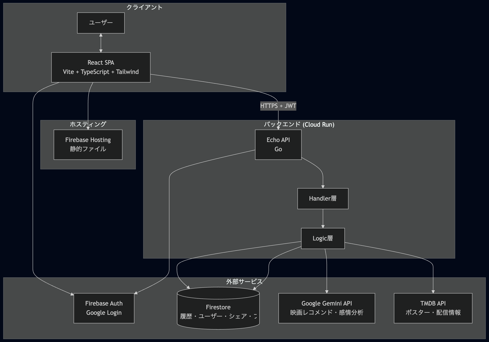

# TYPECAST


**MBTI心理機能ベースの映画レコメンドサービス**

「感情」ではなく「論理」で映画を選ぶ。  
TYPECASTは、MBTIの心理機能（Ti, Ne, Ni, Te など）を刺激するかどうかを基準に、AIが映画をレコメンドするWebアプリケーションです。

<p align="center">
  
  
  
  
  
</p>

---

## プロジェクト概要

### 対象ユーザー

- **MBTIに興味があり、自分のタイプを知っている人**（特に分析志向の INTP / INTJ / ENTP など）
- **「泣ける」「感動する」より、「脚本の整合性」「概念の拡張」「思考実験としての面白さ」を重視する人**
- **何を観るか迷うとき、気分に合わせた映画を論理的な理由付きで知りたい人**

### 解決する課題

- **感情ベースのレコメンドでは刺さらない**  
  従来の「泣ける」「ハッピーになれる」といった指標では、論理・分析志向のユーザーには響きにくい。
- **MBTIと映画の接続が曖昧**  
  タイプ診断はあっても、「そのタイプに本当に合う作品」を心理機能の観点から説明するサービスが少ない。
- **気分と履歴が活かされない**  
  今の気分や過去に観た作品がレコメンドに反映されず、被りや的外れが起こりやすい。

### ソリューションの特徴

- **心理機能ベースの論理レコメンド**  
  16タイプそれぞれの主機能・補助機能（Ti/Ne/Ni/Te 等）を刺激するポイントを、AIが解説付きで提案する。
- **気分 × 感情スコア**  
  入力した「今の気分」をAIが分析し、ポジティブ/ネガティブ度（-5〜+5）を数値化。週間リズムの可視化にも利用。
- **履歴連携・被り防止**  
  過去に提案した映画を自動除外し、利用するほど新しい作品に出会える設計。
- **視聴経路の明示**  
  TMDB連携で日本国内の配信サービス（Netflix, U-NEXT, Prime Video 等）と直リンクを表示。

## アーキテクチャ

モノレポ構成で、フロントエンド（`typecast-web`）とバックエンド（Go API）を一元管理しています。



### システム構成の要点

| レイヤー | 役割 |
|---------|------|
| **Frontend** | React (Vite), Firebase Auth, 履歴・レコメンド・シェア・フィードバックのAPI呼び出し |
| **API (Echo)** | 認証ミドルウェア、レート制限（1日3回）、ルーティング |
| **Logic** | Gemini（レコメンド・感情スコア）、TMDB（メタデータ）、Firestore（履歴・ユーザー・シェア・OGP・フィードバック） |
| **Data** | Firestore（ユーザー、履歴、シェア、フィードバック）、環境変数（APIキー等） |

---

## 主な機能

- **Logic-Based Recommendation**  
  16タイプ対応。心理機能（主・補助）の観点から「なぜこの映画か」をAIが解説。
- **感情スコア & 週間リズム**  
  気分テキストを -5〜+5 でスコア化。7日分溜まると週間チャートを表示。
- **履歴・被り防止**  
  提案映画をFirestoreに保存し、次回以降のレコメンドで自動除外。
- **Watch Providers**  
  TMDB連携で国内配信サービスと視聴リンクを表示。
- **シェア**  
  結果をX (Twitter) 用OGP付きリンクで共有。

---

## テクノロジースタック

| 区分 | 技術 |
|------|------|
| **Frontend** | React 19, Vite, TypeScript, Tailwind CSS, Recharts, Lucide React |
| **Backend** | Go, Echo |
| **AI** | Google Gemini API (gemini-2.0-flash) |
| **データソース** | TMDB API |
| **DB / Auth** | Firebase Firestore, Firebase Authentication (Google) |
| **インフラ** | Google Cloud Run (API), Firebase Hosting (SPA) |
| **DevOps** | Docker, GitHub Actions (CI/CD) |

---

## ローカル開発

### 前提条件

- Go 1.23+
- Node.js 20+
- （任意）Docker

### セットアップ

1. **リポジトリのクローン**
   ```bash
   git clone https://github.com/your-username/typecast.git
   cd typecast
   ```

2. **バックエンド**
   - プロジェクトルートに `.env` を作成:
     ```bash
     PORT=8080
     GEMINI_API_KEY=your_gemini_key
     TMDB_API_KEY=your_tmdb_key
     VITE_FIREBASE_PROJECT_ID=typecast-v2
     FIRESTORE_DB_NAME=(default)
     ```
   - Firestore 用に `service-account.json` を配置（ローカル時）。
   - 起動:
     ```bash
     go run cmd/api/main.go
     ```

3. **フロントエンド**
   - `typecast-web` に移動:
     ```bash
     cd typecast-web
     ```
   - Firebase 設定を `src/firebase.ts` に記載（または .env から読み込み）。
   - `.env` に API のベースURL を設定（ローカルは localhost、本番は Cloud Run URL）:
     ```bash
     # ローカル開発時
     VITE_API_URL=http://localhost:8080
     # 本番ビルド時（CI では GitHub Secrets の VITE_API_URL を使用）
     # VITE_API_URL=https://typecast-api-220731639324.asia-northeast1.run.app
     ```
   - **本番デプロイ**: GitHub Secrets の `VITE_API_URL` を `https://typecast-api-220731639324.asia-northeast1.run.app` に設定すると、フロントのビルドでこの API に接続します。
   - 起動:
     ```bash
     npm install
     npm run dev
     ```

### ライセンス

MIT License


